# Getting started with Microservices and ECS

**Quick jump:**

* [Workshop overview](#overview-of-workshop)
* [Setting up the VPC](#1-setting-up-the-vpc)
* [Setting up the IAM User andRoles](#2-setting-up-the-iam-user-and-roles)
* [Launching the Cluster](#3-launching-the-cluster)
* [Launching the Workstation](#4-launching-the-workstation)
* [Prepping the Docker Images](#5-prepping-the-docker-images)
* [Creating the Container registries with ECR](#6-creating-the-container-registries-with-ecr)
* [Configuring the AWS CLI](#7-configuring-the-aws-cli)
* [Pushing our tested images to ECR](#8-pushing-our-tested-images-to-ecr)
* [Creating the ALB](#9-creating-the-alb)
* [Creating the Task Definitions](#10-creating-the-task-definitions)
* [Creating the Services](#11-creating-the-services)
* [Testing our Service deployments from the Console and ALB](#12-testing-our-service-deployments-from-the-console-and-the-alb)
* [More in-depth logging with Cloudwatch](#13-more-in-depth-logging-with-cloudwatch)

## Overview of workshop

This workshop introduces the basics of working with microservices and [ECS](https://aws.amazon.com/ecs/).  This includes: preparing two microservice container images, setting up the initial ECS cluster, and deployment of the containers with traffic routed through an [ALB](https://aws.amazon.com/elasticloadbalancing/applicationloadbalancer/).

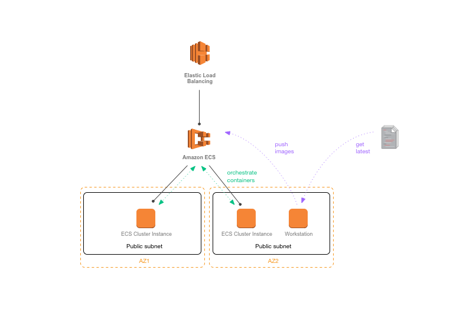

Prior to beginning the workshop, you'll need to [have a working AWS account](<https://aws.amazon.com>). We recommend going through step 1-12 in sequence, however if you are already familiar with the above architecture, you can simply execute [the Lab setup Cloudformation template](cloudformation/ecs-lab-basic-setup.template.json), name it `ecs-lab` and jump ahead to [Step 3. Launching the Cluster](#3-launching-the-cluster). We highly recommend reviewing the cloudformation template to get familiar with what being initialized.

## 1. Setting up the VPC

We first going to create a new VPC for our entire infrastructure. We need
2 public subnets, for our workstation bastian host, ECS cluster and the ALB. Go ahead and configure a VPC with the following requirements:

| field | value |
| ----- | ----- |
| Name tag | ECS Lab VPC |
| IPv4 CIDR | 10.0.0.0/16 |
| **Subnet a**|
| Name tag | Public subnet a |
| CIDR	| 10.0.0.0/24 |
| **Subnet b** |
| Name tag | Public subnet b |
| CIDR | 10.0.1.0/24 |

Side Note: In production you will most likely also have ECS clusters in private subnets. In this case, you will need to remember to attach a NAT gateway onto the subnets so that each ECS Container agent can get updates and retrieve container images from your registry.

## 2. Setting up the IAM user and roles

In order to work with ECS from our workstation, we will need the appropriate permissions for our workstation EC2 Instance, you can do so by going to **Roles** > **Create New Role**
We will later assign this role to our EC2 Workstation Bastian instance:

| field | value |
|-------|-------|
| Select | `Amazon EC2` |
| Attach Policy: | `AmazonEC2ContainerRegistryFullAccess` |
| Role Name: | `ecslabworkstationprofile ` |

We also need to make sure that the EC2 Instance in the ECS clusters have the appropriate permissions to access the container registry, auto-scale, etc. We will later assign this role to the EC2 instances in our ECS cluster.

| field | value |
|-------|-------|
| select | `Amazon EC2` |
| Attach Policy: | `AmazonEC2ContainerServiceforEC2Role`, `AmazonEC2ContainerServiceAutoscaleRole` |
| Role Name: | `ecslabinstanceprofile` |

Side Note: By default, the ECS first run wizard creates `ecsInstanceRole` for you to use. However, it's always best practice to create a specific role for your use so that we can add more policies in the future when we need to.

## 3. Launching the Cluster

Next, we are going to launch the ECS cluster which going to host our container instances. We're going to put these instances in the public subnets since they're going to be hosting end users facing microservices.

Let's create a new security group by navigating to the **EC2 console > Security Group** and create `sgecslabpubliccluster`. Leave everything by default. If you had used the provided Cloudformation you can skip this step.

Navigate to the **EC2 Container Service console > Create Cluster**

| Field Name | Value |
| -----------| ------|
| Cluster Name | `EcsLabPublicCluster` |
| EC2 instance type | `t2.micro` |
| Number of instances | `2` |
| EBS storage | `22` |
| Keypair | `none` |
| VPC | `ECS Lab VPC`|
| Subnets | pick the 2 public subnets |
| Security Group | `sgecslabpubliccluster` |
| IAM Role | `EcsLabInstanceRole` |

Click Create.

## 4. Launching the Workstation

Next, we're going to launch our workstation. Think of this as the developer's machine which runs Docker and have access to our Git repository .

Navigate to the **EC2 Console > Launch Instance**

| Field Name | Value |
| ---------- | ----- |
| AMI: | Amazon Linux AMI 2017.03.0 |
| Instance type: | t2.micro |
| Network: | `ECS Lab VPC` |
| subnet: | one of the public subnet |
| Auto-assign Public IP: | enable |
| role: | `ecslabworkstationprofile` |
| next Storage | (leave default) |
| next tags |
| name: | `ecs-lab-workstation` |
| next security group | create a new security group (or select one if using cloudformation) |
| name: | `sgecslabworkstation` |
| inbound rules: | `SSH TCP 22 Source: My IP` |
| Review and launch | Choose an existing keypair or generate a new one |

Wait for the instance to launch. Once the instance is running, note down the public DNS and then SSH in:

	$ ssh -i cert.pem ec2-user@[public DNS]

We're going to update to the latest AWS CLI

	$ sudo yum update -y

Install docker

	$ sudo yum install -y docker
	$ sudo service docker start

Add `ec2-user` to the docker group so you can execute Docker commands without using `sudo`

	$ sudo usermod -a -G docker ec2-user

Loug out and log back in to pickup the new permissions

Verify that we have everything configured

	$ docker info

	Containers: 2
	Images: 24
	Storage Driver: devicemapper
	 Pool Name: docker-202:1-263460-pool
	 Pool Blocksize: 65.54 kB
	 Data file: /var/lib/docker/devicemapper/devicemapper/data
	 Metadata file: /var/lib/docker/devicemapper/devicemapper/metadata
	 Data Space Used: 702.3 MB
	 Data Space Total: 107.4 GB
	 Metadata Space Used: 1.864 MB
	 Metadata Space Total: 2.147 GB
	 Library Version: 1.02.89-RHEL6 (2014-09-01)
	Execution Driver: native-0.2
	Kernel Version: 3.14.27-25.47.amzn1.x86_64
	Operating System: Amazon Linux AMI 2014.09

We now have a working developer workstation.

## 5. Prepping the Docker images

At this point, we're going to pretend that we're the developers of both the `web` and `api` microservice, and we will get the latest from our source repo. In this case we will just be using the plain old `curl`, but just pretend you're using `git`

	$ curl -O https://s3-us-west-2.amazonaws.com/apn-bootcamps/microservice-ecs-2017/ecs-lab-code-20170511.tar.gz
	$ tar -xvf ecs-lab-code-20170511.tar.gz

Our first step is the build and test our containers locally.  If you've never worked with Docker before, there are a few basic commands that we'll use in this workshop, but you can find a more thorough list in the [Docker "Getting Started" documentation](https://docs.docker.com/engine/getstarted/).

To build your first container, go to the `web` directory. This folder contains our `web` Python Flask microservice:

    $ cd <path/to/project>/ecs-demo/web

To build the container:

    $ docker build -t ecs-lab/web .

This should output steps that look something like this:

    Sending build context to Docker daemon 4.096 kB
    Sending build context to Docker daemon
    Step 0 : FROM ubuntu:latest
     ---> 6aa0b6d7eb90
    Step 1 : MAINTAINER widha@amazon.com
     ---> Using cache
     ---> 3f2b91d4e7a9

If the container builds successfully, the output should end with something like this:

     Removing intermediate container d2cd523c946a
     Successfully built ec59b8b825de

To run your container:

     $  docker run -d -p 3000:3000 ecs-lab/web

This command run the image in daemon mode and map the docker container port 3000 with the host's (in this case our workstation) port 3000. We're doing this so that we can run both microservices in a single host without conflicting ports.

To check if your container is running:

     $ docker ps

This should return a list of all the currently running containers.  In this example,  it should just return a single container, the one that we just started:

    CONTAINER ID        IMAGE                 COMMAND             CREATED              STATUS              PORTS                              NAMES
    fa922a2376d5        ecs-lab-web:latest   "python app.py"     About a minute ago   Up About a minute   3000/tcp,    0.0.0.0:3000->3000/tcp   cocky_northcutt   

To test the actual container output:

     $ curl localhost:3000/web

This should return:

     <html><head>...</head><body>hi!  i'm served via Python + Flask.  i'm a web endpoint. ...</body></html>

Repeat the same steps with the api microservice. Change directory to `/api` and repeat the same steps above:

    $ cd <path/to/project>/ecs-lab/api
    $ docker build -t ecs-lab/api .
    $ docker run -d -p 8000:8000 ecs-lab/api
    $ curl localhost:8000/api

The API container should return:

    { "response" : "hi!  i'm ALSO served via Python + Flask.  i'm an API." }

We now have two working microservice container images.

## 6. Creating the container registries with ECR

Before we can build and push our images, we need somewhere to push them to.  In this case, we're going to create two repositories in [ECR](https://aws.amazon.com/ecr/).

To create a repository, navigate to the ECS console, and select **Repositories**.  From there, choose **Create repository**.

Name your first repository **ecs-lab/web**:

Once you've created the repository, it will display the push commands.  Take note of these, as you'll need them in the next step.  The push commands should like something like this:

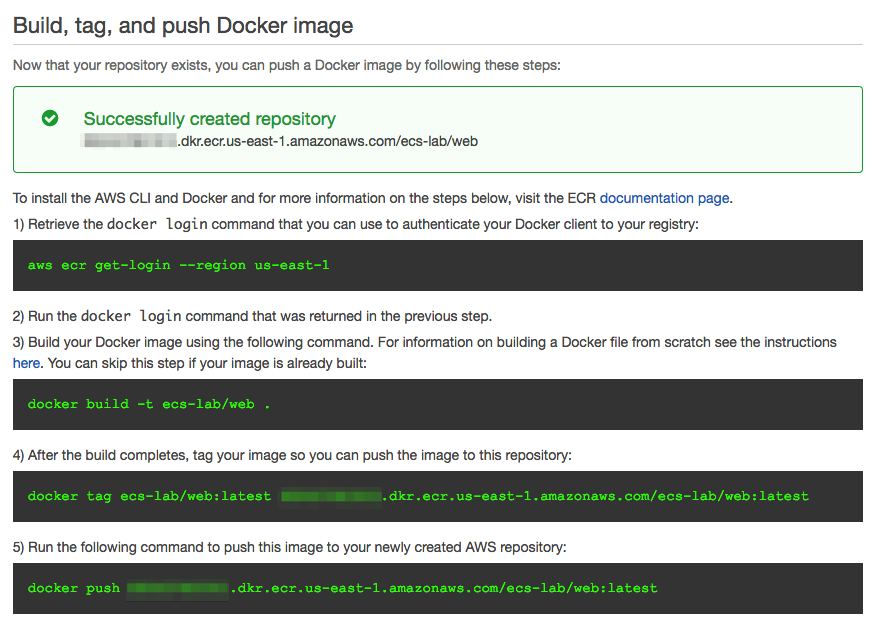

Once you've created the ecs-lab-web, repeat the process for a second repository.  This one should be named **ecs-lab/api**.  Take note of the push commands for this second repository, also. Push commands are unique per repository.

## 7. Configuring the AWS CLI

Back to our workstation. If you've never configured the AWS CLI, the easiest way is by running:

    $ aws configure

This should drop you into a setup wizard. Note that since our workstation is an EC2 instance with pre-configured IAM role, we do not have to provide access key ID. We simply want to specify our default region at this point:

    $ aws configure
    AWS Access Key ID: <leave empty>
    AWS Secret Access Key: <leave empty>
    Default region name [us-east-1]: us-east-1
    Default output format [json]: <leave empty>

You can test that your IAM user has the correct permissions, and that your CLI is setup to connect to your AWS account by running the command to obtain an ECR authentication token.  This will allow us to pull our registries in the next step:

    $ aws ecr get-login --region us-east-1

This should output something like:

    $ docker login -u AWS -p AQECAHhwm0YaISJeRtJm5n1G6uqeekXuoXXPe5UFce9Rq8/14wAAAy0wggMpBgkqhkiG9w0BBwagggMaMIIDFgIBADCCAw8GCSqGSIb3DQEHATAeBglghkgBZQMEAS4wEQQM+76slnFaYrrZwLJyAgEQgIIC4LJKIDmvEDtJyr7jO661//6sX6cb2jeD/RP0IA03wh62YxFKqwRMk8gjOAc89ICxlNxQ6+cvwjewi+8/W+9xbv5+PPWfwGSAXQJSHx3IWfrbca4WSLXQf2BDq0CTtDc0+payiDdsXdR8gzvyM7YWIcKzgcRVjOjjoLJpXemQ9liPWe4HKp+D57zCcBvgUk131xCiwPzbmGTZ+xtE1GPK0tgNH3t9N5+XA2BYYhXQzkTGISVGGL6Wo1tiERz+WA2aRKE+Sb+FQ7YDDRDtOGj4MwZ3/uMnOZDcwu3uUfrURXdJVddTEdS3jfo3d7yVWhmXPet+3qwkISstIxG+V6IIzQyhtq3BXW/I7pwZB9ln/mDNlJVRh9Ps2jqoXUXg/j/shZxBPm33LV+MvUqiEBhkXa9cz3AaqIpc2gXyXYN3xgJUV7OupLVq2wrGQZWPVoBvHPwrt/DKsNs28oJ67L4kTiRoufye1KjZQAi3FIPtMLcUGjFf+ytxzEPuTvUk4Xfoc4A29qp9v2j98090Qx0CHD4ZKyj7bIL53jSpeeFDh9EXubeqp6idIwG9SpIL9AJfKxY7essZdk/0i/e4C+481XIM/IjiVkh/ZsJzuAPDIpa8fPRa5Gc8i9h0bioSHgYIpMlRkVmaAqH/Fmk+K00yG8USOAYtP6BmsFUvkBqmRtCJ/Sj+MHs+BrSP7VqPbO1ppTWZ6avl43DM0blG6W9uIxKC9SKBAqvPwr/CKz2LrOhyqn1WgtTXzaLFEd3ybilqhrcNtS16I5SFVI2ihmNbP3RRjmBeA6/QbreQsewQOfSk1u35YmwFxloqH3w/lPQrY1OD+kySrlGvXA3wupq6qlphGLEWeMC6CEQQKSiWbbQnLdFJazuwRUjSQlRvHDbe7XQTXdMzBZoBcC1Y99Kk4/nKprty2IeBvxPg+NRzg+1e0lkkqUu31oZ/AgdUcD8Db3qFjhXz4QhIZMGFogiJcmo= -e none https://<account_id>.dkr.ecr.us-east-1.amazonaws.com

To login to ECR, copy and paste that output or just run `` `aws ecr get-login --region us-east-1` `` which will tell your shell to execute the output of that command.  That should return something like:

    Login Succeeded

If you are unable to login to ECR, check your IAM user group permissions.

## 8. Pushing our tested images to ECR

Now that we've tested our images locally, we need to tag them again, and push them to ECR.  This will allow us to use them in Task Definitions that can be deployed to an ECS cluster.  

You'll need your push commands that you saw during registry creation.  If you've misplaced your push commands, you can find them again by going back to the repository (**ECS Console** > **Repositories** > Select the Repository you want to see the commands for > **View Push Commands**.

To tag and push the web repository:

    $ docker tag ecs-lab/web:latest <account_id>.dkr.ecr.us-east-1.amazonaws.com/ecs-lab-web:latest
    $ docker push <account_id>.dkr.ecr.us-east-1.amazonaws.com/ecs-lab/web:latest

This should return something like this:

    The push refers to a repository [<account_id>.ecr.us-east-1.amazonaws.com/ecs-lab-web] (len: 1)
    ec59b8b825de: Image already exists
    5158f10ac216: Image successfully pushed
    860a4e60cdf8: Image successfully pushed
    6fb890c93921: Image successfully pushed

    aa78cde6a49b: Image successfully pushed
    Digest: sha256:fa0601417fff4c3f3e067daa7e533fbed479c95e40ee96a24b3d63b24938cba8

To tag and push the api repository:

    $ docker tag ecs-lab/api:latest <account_id>.dkr.ecr.us-east-1.amazonaws.com/ecs-lab-api:latest
    $ docker push <account_id>.dkr.ecr.us-east-1.amazonaws.com/ecs-lab-api:latest

Note: why `:latest`?  This is the actual image tag.  In most production environments, you'd tag images for different schemes:  for example, you might tag the most up-to-date image with `:latest`, and all other versions of the same container with a commit SHA from a CI job.  If you push an image without a specific tag, it will default to `:latest`, and untag the previous image with that tag.  For more information on Docker tags, see the Docker [documentation](https://docs.docker.com/engine/getstarted/step_six/).

You can see your pushed images by viewing the repository in the AWS Console.  Alternatively, you can use the CLI:

    $ aws ecr list-images --repository-name=ecs-lab/api
    {
        "imageIds": [
            {
                "imageTag": "latest",
                "imageDigest": "sha256:f0819d27f73c7fa6329644efe8110644e23c248f2f3a9445cbbb6c84a01e108f"
            }  
        ]
    }

## 9. Creating the ALB

Now that we've pushed our images, we need an Application Load Balancer [ALB](https://aws.amazon.com/elasticloadbalancing/applicationloadbalancer/) to route traffic to our endpoints. Compared to a traditional load balancer, an ALB lets you direct traffic between different endpoints.  In our example, we'll use two separate endpoints:  `/web` and `/api`.

To create the ALB:

Navigate to the **EC2 Console**, and select **Load Balancers** from the left-hand menu.  Choose **Create Load Balancer**:

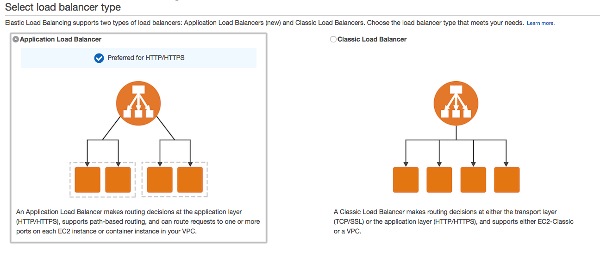

Name your ALB **EcsLabAlb** and add an HTTP listener on port 80:

Note:  in a production environment, you should also have a secure listener on port 443.  This will require an SSL certificate, which can be obtained from [AWS Certificate Manager](https://aws.amazon.com/certificate-manager/), or from your registrar/any CA.  For the purposes of this demo, we will only create the insecure HTTP listener.  DO NOT RUN THIS IN PRODUCTION.

Next, select your VPC and we need at least two subnets for high availability.  Make sure to choose the VPC that we created earlier.

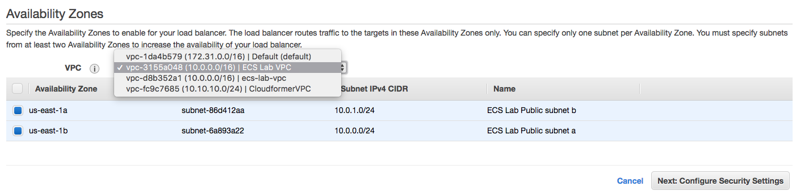

Next, add a security group.  If you ran the cloudformation, you should have an existing group called something like **<stackname>-sgecslabpublic-QWERTY123**.  If you don't have this, check you've chosen the correct VPC, as security groups are VPC specific.  If you still don't have this, you can create a new security groups with the following rule:

    Ports	    Protocol	    Source
     80	          tcp	       0.0.0.0/0

Choose the security group, and continue to the next step:  adding routing.  For this initial setup, we're just adding a dummy healthcheck on `/`.  We'll add specific healthchecks for our service endpoints when we register them with the ALB.

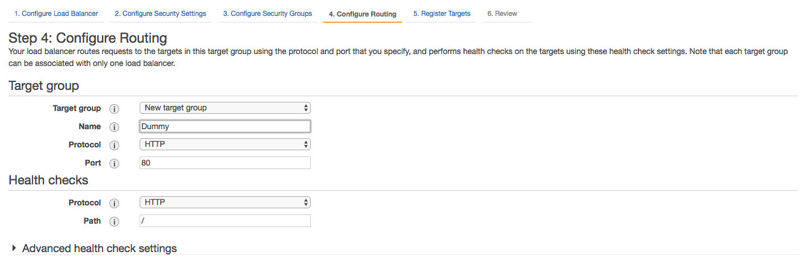

Finally, skip the "Register targets" step, and continue to review. If your values look correct, click **Create**.

Note:  If you created your own security group for the ECS Cluster (`sgecslabpubliccluster`), and only added a rule for port 80, you'll need to add one more.  Select your security group from the list > **Inbound** > **Edit** and add a rule to allow your ALB to access the port range for ECS (0-65535) for port mapping. The final rules should look like:

     Type        Ports        Protocol        Source
     HTTP          80	        tcp	         0.0.0.0/0
     All TCP      0-65535       tcp       <id of this security group>

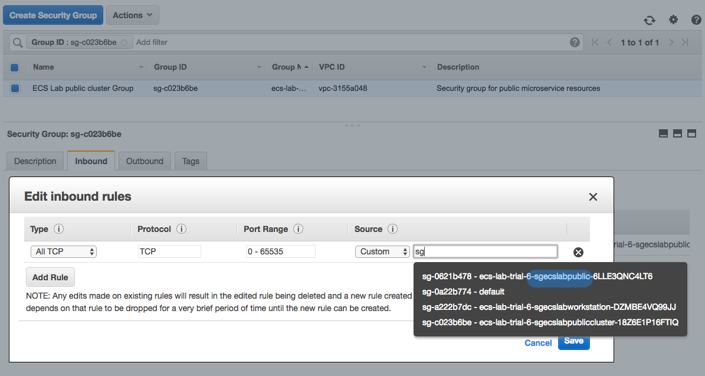

We now have the following security group setup:

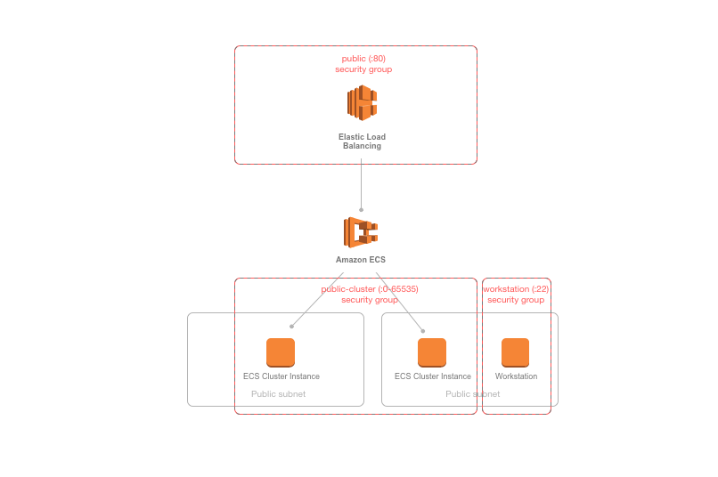

## 10. Creating the Task Definitions

Before you can register a container to a service, it needs be a part of a Task Definition. Task Definitions define things like environment variables, the container image you wish to use, and the resources you want to allocate to the service (port, memory, CPU).  To create a Task Definition, choose **Task Definitions** from the ECS console menu.  Then, choose **Create a Task Definition**:

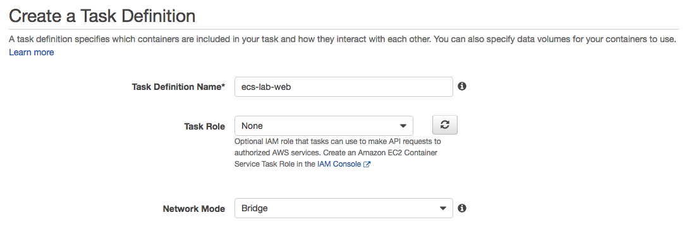

Continue to adding a container definition, click on **Add Container**.  

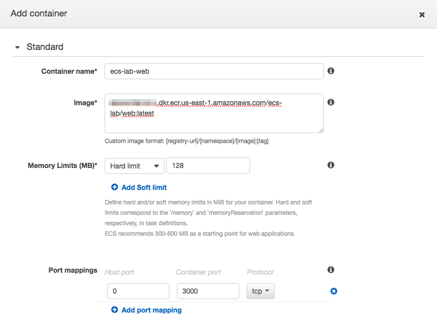

A few things to note here:

- We've specified a specific container image, including the `:latest` tag.  Although it's not important for this demo, in a production environment where you were creating Task Definitions programmatically from a CI/CD pipeline, Task Definitions could include a specific SHA, or a more accurate tag.

- Under **Port Mappings**, we've specified a **Container Port** (3000), but left **Host Port** as 0.  This was intentional, and is used to faciliate dynamic port allocation.  This means that we don't need to map the Container Port to a specific Host Port in our Container Definition-  instead, we can let the ALB allocate a port during task placement.  To learn more about port allocation, check out the [ECS documentation here](http://docs.aws.amazon.com/AmazonECS/latest/APIReference/API_PortMapping.html).

Once you've specified your Port Mappings, scroll down and add a log driver.  There are a few options here, but for this demo, choose **awslogs**:

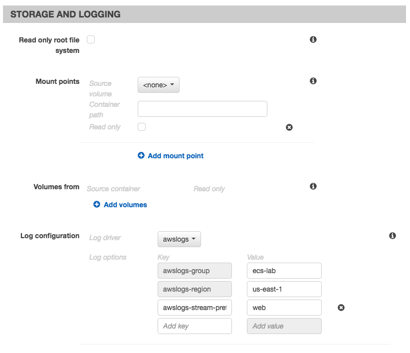

For this web container, make sure the **awslogs-stream-prefix** is **web**. Once you've added your log driver, save the Container Definition by clicking **Add**, and create the Task Definition.

Repeat the Task Definition creation process with the API container, taking care to use the api container image registry, and the correct port (8000) for the **Container Port** option.  For the log driver, make sure the **awslogs-stream-prefix** is **api**.

Let's create the log group by navigating to the **CloudWatch > Logs > Actions > Create Log Group**

| Field | Value |
| ----- | ----- |
| Log Group Name | `ecs-lab` |

## 11. Creating the Services

Next, we're going to create the service. A service is a group of tasks (which are containers). Here you can define how many tasks you want to run simultaneously and several more configuration around their lifecycle.

First, we need to create a IAM role for this Service. Navigate to **IAM > Create Role ** Select `Amazon EC2 Container Service Role`, attach the default policy and let's call it `EcsLabServiceRole`

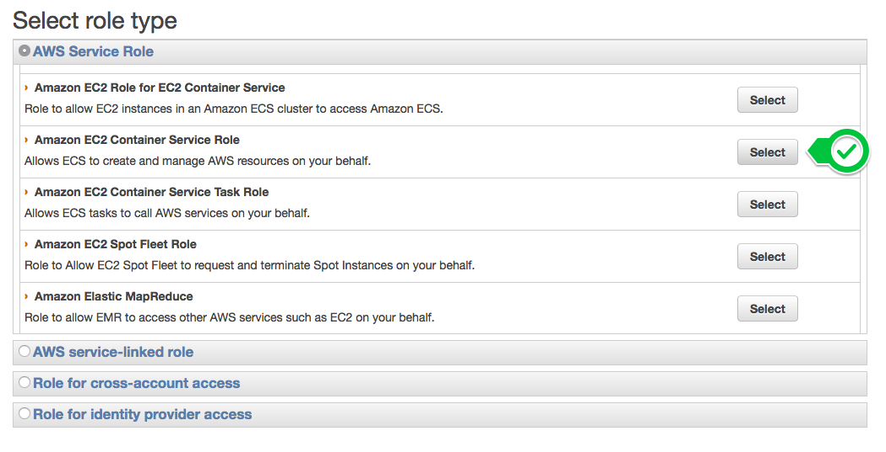

Navigate back to the ECS console, and choose the cluster that you created.  This should be named **EcsLabPublicCluster**. Next, you'll n eed to create your web service.  From the cluster detail page, choose **Services** > **Create**.

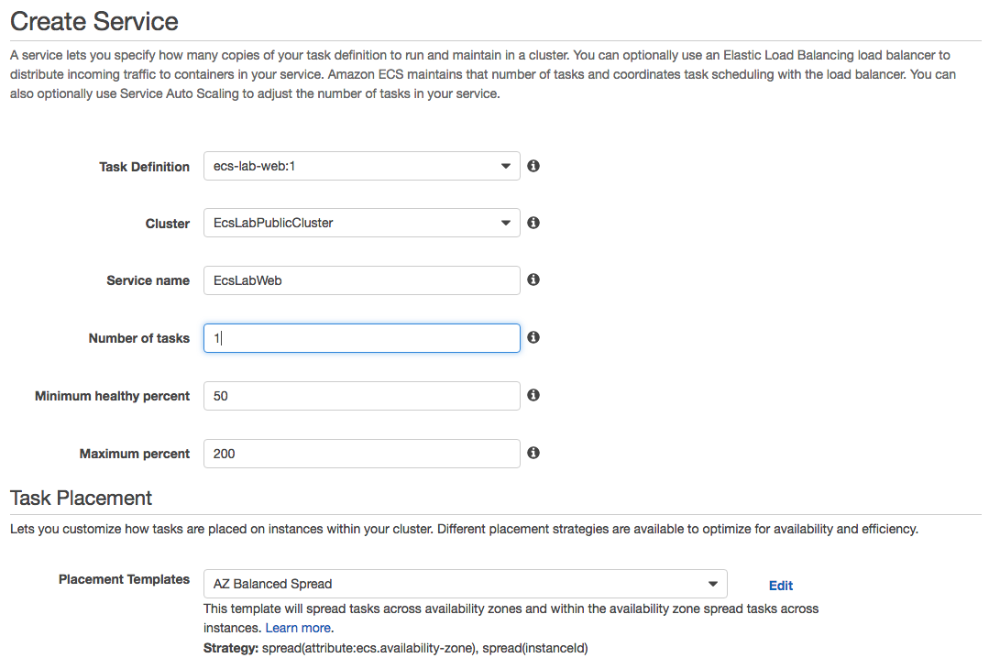

Choose the web Task Definition you created in the previous section.  For the purposes of this demo, we'll only start one copy of each task.  In a production environment, you will always want more than one copy of each task running for reliability and availability.

You can keep the default **AZ Balanced Spread** for the Task Placement Policy.  To learn more about the different Task Placement Policies, see the [documentation](http://docs.aws.amazon.com/AmazonECS/latest/developerguide/task-placement-strategies.html), or this [blog post](https://aws.amazon.com/blogs/compute/introducing-amazon-ecs-task-placement-policies/).

Under **Optional Configurations**, choose **Configure ELB**:

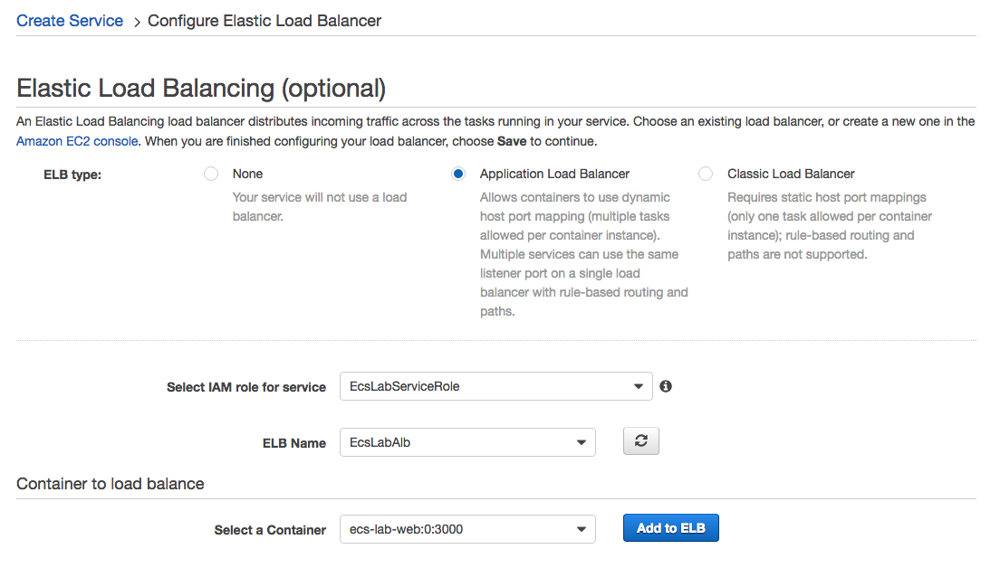

Select the web container, choose **Add to ELB**.  

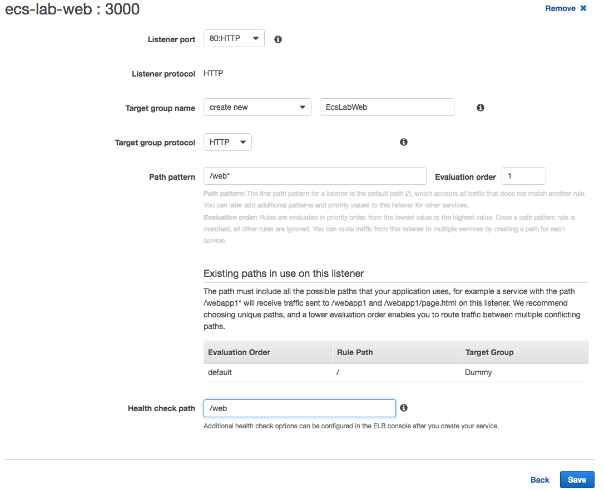

This final step allows you to configure the container with the ALB.  When we created our ALB, we only added a listener for HTTP:80.  Select this from the dropdown as the value for **Listener**.  For **Target Group Name**, enter a value that will make sense to you later, like **ecs-lab-web**.  For **Path Pattern**, the value should be **`/web*`**.  This is the route that we specified in our Python application.

If the values look correct, click **Save** to add your Container. Then **Create Service**

Repeat this process for the `api` microservice and task definition. Don't forget to adjust the target group name, path pattern, evaluation order and health check path accordingly.  

## 12. Testing our service deployments from the console and the ALB

You can see service level events from the ECS console.  This includes deployment events. You can test that both of your services deployed, and registered properly with the ALB by looking at the service's **Events** tab:

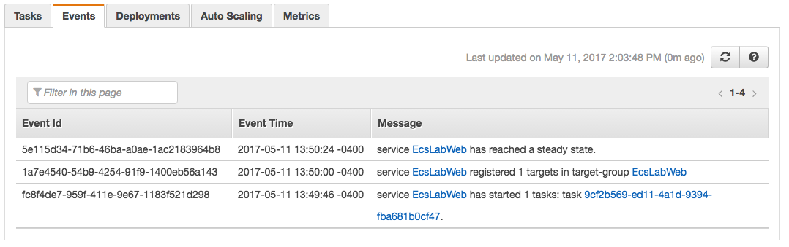

We can also test from the ALB itself.  To find the DNS A record for your ALB, navigate to the EC2 Console > **Load Balancers** > **Select your Load Balancer**.  Under **Description**, you can find details about your ALB, including a section for **DNS Name**.  You can enter this value in your browser, and append the endpoint of your service, to see your ALB and ECS Cluster in action:

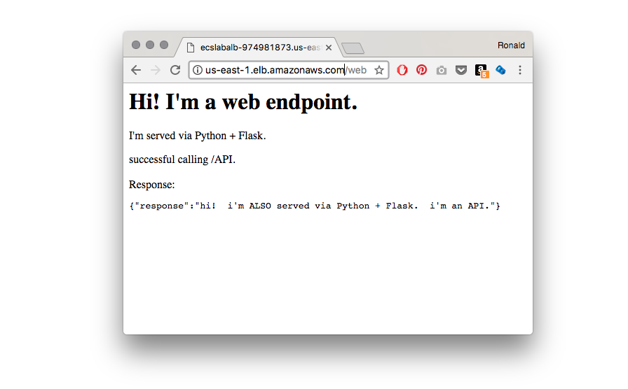

You can see that the ALB routes traffic appropriately based on the paths we specified when we registered the containers:  `/web*` requests go to our web service, and `/api*` requests go to our API service.

## 13. More in-depth logging with Cloudwatch

When we created our Container Definitions, we also added the awslogs driver, which sends logs to [Cloudwatch](https://aws.amazon.com/cloudwatch/).  You can see more details logs for your services by going to the Cloudwatch console, and selecting first our log group `ecs-lab` and then choosing an individual stream:

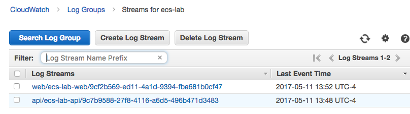

## That's a wrap!

Congratulations!  You've deployed an ECS Cluster with two working endpoints.  

## Clean up
Don't forget to do the following, after you're finished with the lab:

- Go to the **Cloudformation Console** and delete the `EC2ContainerService-EcsLabPublicCluster` stack
- Delete the `ecs-lab` stack
- Go to **Cloudwatch Console > Logs** and delete Log Group `ecs-lab`
- Go to **ECS Console > Repositories** and delete the cluster, deregister the 2 task definitions, delete the 2 created repositories
- Go to the **EC2 Console**, terminate the `ecs-lab-workstation` EC2 Instance, the Application Load Balancer and the 3 Target Groups
- Go to **IAM console** and delete the 2 roles `EcslabInstanceRole` and `EcsWorkstationRole`

## Find the above a little boring?

Here are some ideas to make it more interesting:

- The development team refactored our api and now it requires a host with GPU P2. Deploy the api containers to GPU P2 by defining a [Task Placement Constraint](http://docs.aws.amazon.com/AmazonECS/latest/developerguide/cluster-query-language.html)
